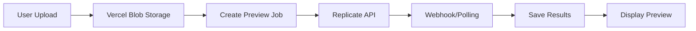

# Studio Improvement Plan
Continue from STUDIO_IMPROVEMENT_PLAN.md Phase 1.
  Focus on implementing critical fixes starting with error
  handling
  and user feedback improvements in the studio page.
  
## Current Implementation Overview

### Architecture Flow


### Key Components
1. **Frontend**: `/app/studio/page.tsx` - React form with file uploads and parameter controls
2. **Upload API**: `/app/api/upload/route.ts` - Handles image uploads to Vercel Blob
3. **Preview API**: `/app/api/preview/route.ts` - Creates jobs and triggers Replicate
4. **Status API**: `/app/api/preview/[id]/route.ts` - Polls for results
5. **Webhook**: `/app/api/webhooks/replicate/route.ts` - Receives async results
6. **Public Share**: `/app/p/[id]/page.tsx` - Shareable preview pages

### Current Features
- ✅ Image upload (body photo + design)
- ✅ Parameter controls (scale, rotation, opacity, style)
- ✅ AI prompt generation
- ✅ Credit consumption system
- ✅ Real-time status updates
- ✅ Public shareable links
- ✅ Development mode with unlimited credits

### Known Issues
- ⚠️ Localhost development requires Vercel Blob (Replicate can't access localhost)
- ⚠️ 2-second polling is inefficient
- ⚠️ No image optimization/compression
- ⚠️ Limited error messages
- ⚠️ No mobile optimization
- ⚠️ No cleanup for failed jobs
- ⚠️ Public URLs never expire

## Phase 1: Critical Fixes (Week 1)

### 1.1 Error Handling & User Feedback
```typescript
// Improve error messages with specific guidance
const ERROR_MESSAGES = {
  UPLOAD_FAILED: "Upload failed. Please check your internet connection and try again.",
  CREDITS_INSUFFICIENT: "You need credits to generate a preview. Buy credits to continue.",
  REPLICATE_ERROR: "AI generation failed. Your credit has been refunded. Please try again.",
  INVALID_IMAGE: "Please upload a valid image (JPG, PNG, or WebP under 10MB)"
};

// Add toast notifications for all actions
import { toast } from 'sonner';
```

### 1.2 Image Optimization
```typescript
// Client-side compression before upload
import imageCompression from 'browser-image-compression';

const compressImage = async (file: File) => {
  const options = {
    maxSizeMB: 2,
    maxWidthOrHeight: 2048,
    useWebWorker: true
  };
  return await imageCompression(file, options);
};
```

### 1.3 Loading States
- Add skeleton loaders during upload
- Progress bar for file uploads
- Better loading animation during generation
- Time estimate display ("Usually takes 30-60 seconds")

### 1.4 Credit Refund System
```typescript
// Automatic refund on failures
if (prediction.status === 'failed') {
  await refundCredits(userId, 1);
  await notifyUser('Generation failed. Your credit has been refunded.');
}
```

## Phase 2: UX Improvements (Week 2)

### 2.1 Mobile Responsive Design
```tsx
// Mobile-first studio layout
<div className="grid grid-cols-1 lg:grid-cols-2 gap-4">
  {/* Upload section - full width on mobile */}
  <div className="col-span-1">
    <UploadSection />
  </div>
  
  {/* Controls - collapsible on mobile */}
  <div className="col-span-1">
    <Accordion>
      <AccordionItem value="params">
        <AccordionTrigger>Customize Your Tattoo</AccordionTrigger>
        <AccordionContent>
          <ParameterControls />
        </AccordionContent>
      </AccordionItem>
    </Accordion>
  </div>
</div>
```

### 2.2 Real-time Updates with SSE
```typescript
// Replace polling with Server-Sent Events
// /app/api/preview/[id]/stream/route.ts
export async function GET(req: Request, { params }: { params: { id: string } }) {
  const stream = new ReadableStream({
    async start(controller) {
      const encoder = new TextEncoder();
      
      const sendUpdate = (data: any) => {
        controller.enqueue(encoder.encode(`data: ${JSON.stringify(data)}\n\n`));
      };
      
      // Monitor job status
      const interval = setInterval(async () => {
        const job = await getJobStatus(params.id);
        sendUpdate(job);
        
        if (job.status === 'completed' || job.status === 'failed') {
          clearInterval(interval);
          controller.close();
        }
      }, 1000);
    }
  });
  
  return new Response(stream, {
    headers: {
      'Content-Type': 'text/event-stream',
      'Cache-Control': 'no-cache',
      'Connection': 'keep-alive',
    },
  });
}
```

### 2.3 Preview Gallery
```tsx
// Add recent previews section
<div className="mt-8">
  <h3 className="text-lg font-semibold mb-4">Your Recent Previews</h3>
  <div className="grid grid-cols-2 md:grid-cols-4 gap-4">
    {recentPreviews.map(preview => (
      <PreviewCard 
        key={preview.id}
        preview={preview}
        onReuse={() => reuseSettings(preview)}
      />
    ))}
  </div>
</div>
```

### 2.4 Drag & Drop Upload
```tsx
// Enhanced upload with drag & drop
<div 
  onDrop={handleDrop}
  onDragOver={handleDragOver}
  className={`border-2 border-dashed rounded-lg p-8 text-center transition-colors
    ${isDragging ? 'border-yellow-400 bg-yellow-400/10' : 'border-gray-300'}`}
>
  <Upload className="mx-auto h-12 w-12 text-gray-400" />
  <p className="mt-2">Drag & drop or click to upload</p>
</div>
```

## Phase 3: Advanced Features (Week 3-4)

### 3.1 Batch Processing
```typescript
// Generate multiple variations at once
interface BatchPreviewRequest {
  bodyPhoto: string;
  design: string;
  variations: Array<{
    style: string;
    scale: number;
    rotation: number;
  }>;
}

// Bulk discount: 3 variations for 2 credits
```

### 3.2 Smart Placement Suggestions
```typescript
// AI-powered placement recommendations
const suggestPlacements = async (design: File, bodyPart: string) => {
  // Analyze design dimensions and style
  const analysis = await analyzeDesign(design);
  
  // Return recommended parameters
  return {
    scale: analysis.recommendedScale,
    rotation: analysis.optimalRotation,
    position: analysis.bestPosition
  };
};
```

### 3.3 Collaborative Features
```typescript
// Share with clients for approval
interface ShareablePreview {
  id: string;
  shareUrl: string;
  expiresAt: Date;
  password?: string;
  allowComments: boolean;
  allowDownload: boolean;
}

// Client feedback system
interface ClientFeedback {
  previewId: string;
  rating: number;
  comments: string;
  requestedChanges?: string[];
}
```

### 3.4 Advanced Editing
```tsx
// In-browser adjustments
<Canvas 
  image={previewResult}
  onAdjust={(adjustments) => {
    // Apply filters, brightness, contrast
    applyAdjustments(adjustments);
  }}
/>
```

## Phase 4: Performance & Scale (Month 2)

### 4.1 Caching Strategy
```typescript
// Redis cache for common operations
const getCachedPreview = async (params: PreviewParams) => {
  const cacheKey = generateCacheKey(params);
  const cached = await redis.get(cacheKey);
  
  if (cached && !params.forceRefresh) {
    return cached;
  }
  
  const result = await generatePreview(params);
  await redis.set(cacheKey, result, 'EX', 3600); // 1 hour cache
  return result;
};
```

### 4.2 CDN Integration
```typescript
// CloudFlare Images for optimization
const optimizeImage = async (url: string) => {
  return `https://imagedelivery.net/${CF_ACCOUNT}/${url}/public`;
};
```

### 4.3 Analytics Dashboard
```tsx
// Studio analytics for artists
<Dashboard>
  <MetricCard title="Previews Generated" value={stats.totalPreviews} />
  <MetricCard title="Credits Used" value={stats.creditsUsed} />
  <MetricCard title="Popular Styles" value={stats.topStyles} />
  <ChartCard title="Usage Trend" data={stats.dailyUsage} />
</Dashboard>
```

### 4.4 API Rate Limiting
```typescript
// Prevent abuse with rate limiting
import { Ratelimit } from '@upstash/ratelimit';

const ratelimit = new Ratelimit({
  redis,
  limiter: Ratelimit.slidingWindow(10, '1 m'), // 10 requests per minute
});
```

## Database Schema Improvements

```sql
-- Add indexes for performance
CREATE INDEX idx_preview_jobs_user_status ON preview_jobs(userId, status);
CREATE INDEX idx_preview_results_created ON preview_results(createdAt DESC);

-- Add cleanup tracking
ALTER TABLE preview_jobs ADD COLUMN cleanup_at TIMESTAMP;
ALTER TABLE body_photos ADD COLUMN expires_at TIMESTAMP;

-- Add analytics tables
CREATE TABLE preview_analytics (
  id SERIAL PRIMARY KEY,
  preview_id INT REFERENCES preview_jobs(id),
  view_count INT DEFAULT 0,
  download_count INT DEFAULT 0,
  share_count INT DEFAULT 0,
  client_rating INT,
  created_at TIMESTAMP DEFAULT NOW()
);
```

## Environment Variables to Add

```env
# Performance
REDIS_URL=redis://localhost:6379
CF_ACCOUNT_ID=your_cloudflare_account
CF_API_TOKEN=your_cloudflare_token

# Features
ENABLE_BATCH_PROCESSING=true
MAX_BATCH_SIZE=5
ENABLE_SMART_PLACEMENT=true

# Cleanup
PREVIEW_RETENTION_DAYS=30
CLEANUP_CRON_SCHEDULE="0 0 * * *"

# Analytics
MIXPANEL_TOKEN=your_mixpanel_token
GOOGLE_ANALYTICS_ID=G-XXXXXXXXXX
```

## Testing Strategy

### Unit Tests
```typescript
// Test credit consumption
describe('Credit System', () => {
  it('should consume 1 credit per preview', async () => {
    const initialCredits = await getUserCredits(userId);
    await generatePreview(mockParams);
    const finalCredits = await getUserCredits(userId);
    expect(finalCredits).toBe(initialCredits - 1);
  });
  
  it('should refund credit on failure', async () => {
    // Test refund logic
  });
});
```

### E2E Tests
```typescript
// Full flow testing with Playwright
test('Complete preview generation flow', async ({ page }) => {
  await page.goto('/studio');
  await page.setInputFiles('#body-photo', 'test-body.jpg');
  await page.setInputFiles('#design', 'test-tattoo.png');
  await page.selectOption('#body-part', 'arm');
  await page.click('button:has-text("Generate Preview")');
  
  await expect(page.locator('.preview-result')).toBeVisible({
    timeout: 60000
  });
});
```

## Monitoring & Alerts

```typescript
// Set up monitoring with Sentry
Sentry.init({
  dsn: process.env.SENTRY_DSN,
  tracesSampleRate: 0.1,
  integrations: [
    new Sentry.Integrations.Http({ tracing: true }),
    new Sentry.Integrations.Postgres(),
  ],
});

// Custom alerts for critical issues
const alertOnCreditFailure = async (error: Error, userId: number) => {
  await Sentry.captureException(error, {
    tags: { component: 'credits', userId },
    level: 'error',
  });
  
  // Send Slack notification
  await notifySlack({
    channel: '#alerts',
    text: `Credit consumption failed for user ${userId}: ${error.message}`
  });
};
```

## Success Metrics

### KPIs to Track
1. **Preview Generation Success Rate**: Target > 95%
2. **Average Generation Time**: Target < 45 seconds
3. **Credit Refund Rate**: Target < 5%
4. **User Retention**: Target > 60% monthly active
5. **Mobile Usage**: Target > 40% of traffic

### User Satisfaction
- NPS Score: Target > 50
- Support Tickets: < 2% of users
- Feature Adoption: > 30% use advanced features

## Next Immediate Steps (For New Context)

1. **Start with Phase 1.1**: Implement proper error handling with user-friendly messages
2. **Add toast notifications**: Use Sonner or React Hot Toast for feedback
3. **Implement image compression**: Add client-side compression before upload
4. **Fix mobile layout**: Make the studio responsive with collapsible sections
5. **Add loading states**: Skeleton loaders and progress indicators
6. **Implement credit refunds**: Automatic refund on generation failures
7. **Create preview gallery**: Show recent previews for reuse
8. **Add drag & drop**: Enhance upload UX with drag and drop support

## Command to Start Next Session

```
"Continue from STUDIO_IMPROVEMENT_PLAN.md Phase 1. 
Focus on implementing critical fixes starting with error handling 
and user feedback improvements in the studio page."
```

This plan provides a clear roadmap for improving the studio with prioritized phases and specific implementation details.
